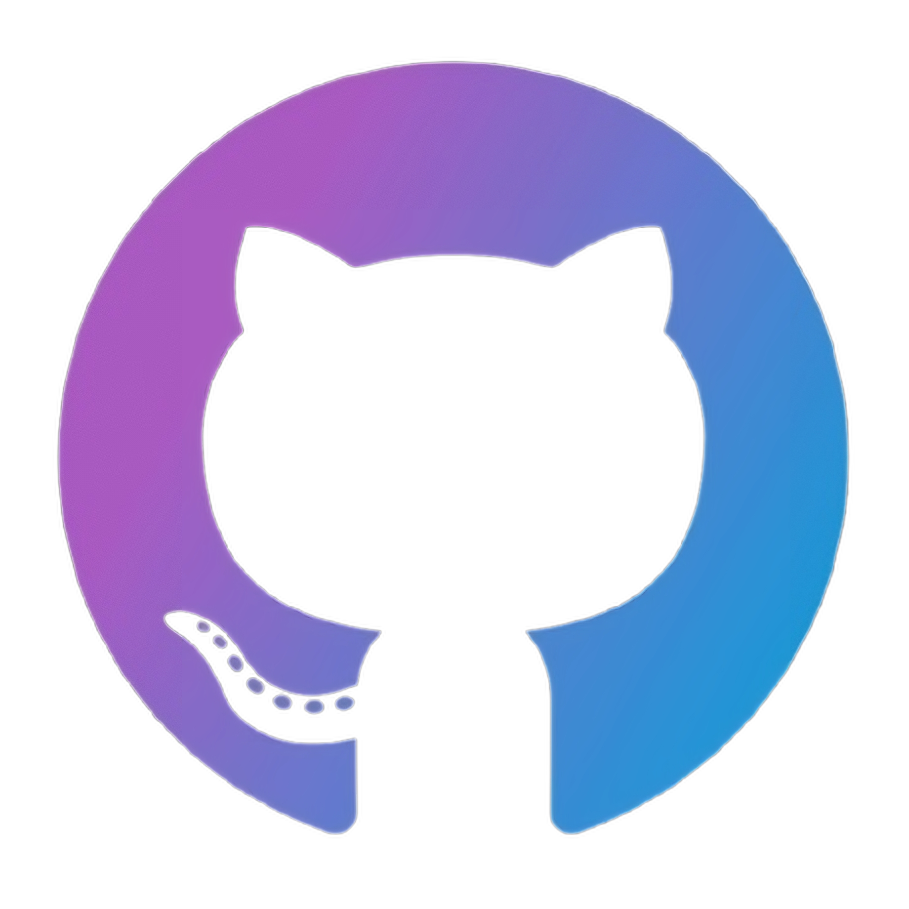
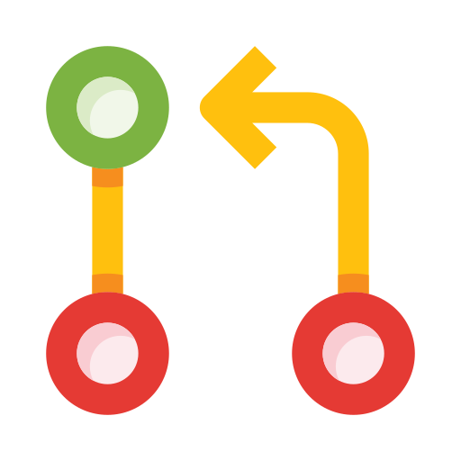

<h1 align="center">
  
</h1>
<h1 align="center">
  
</h1>
<p align="center">
  <a href="https://github.com/alvinsjoy">
    
  </a>
</p>
<p align="center">
  <a href="https://discord.com/users/825382504353234954">
    <picture>
      <source alt="discord" media="(prefers-color-scheme: dark)" srcset="https://discord.c99.nl/widget/theme-4/825382504353234954.png" >
      
    </picture>
  </a>
</p>

<p align="center">
  Most of my repositories are private. The stats below show info about public repos.
</p>
<p>
  <a href="https://github.com/alvinsjoy">
    
  </a>
</p>
<h3 align="left">&nbsp;&nbsp;Recent GitHub Activity</h3>

<!--START_SECTION:activity-->
1. 💪 Opened PR [#21435](https://github.com/is-a-dev/register/pull/21435) in [is-a-dev/register](https://github.com/is-a-dev/register)
2. 💪 Opened PR [#105](https://github.com/zaidmukaddam/scira/pull/105) in [zaidmukaddam/scira](https://github.com/zaidmukaddam/scira)
3. 🗣 Commented on [#20596](https://github.com/is-a-dev/register/pull/20596#issuecomment-2688402455) in [is-a-dev/register](https://github.com/is-a-dev/register)
4. 💪 Opened PR [#20596](https://github.com/is-a-dev/register/pull/20596) in [is-a-dev/register](https://github.com/is-a-dev/register)
5. 🎉 Merged PR [#4](https://github.com/alvinsjoy/Hive/pull/4) in [alvinsjoy/Hive](https://github.com/alvinsjoy/Hive)
<!--END_SECTION:activity-->
<br>
<p align="center">
  <a href="https://github.com/alvinsjoy">
    
  </a>
  <a href="https://github.com/alvinsjoy">
    
  </a>
  <a href="https://github.com/alvinsjoy">
    
  </a>
</p>
<h3 align="center">
  &nbsp;&nbsp;My coding activity
</h3>

<!--START_SECTION:waka-->

```py
From: 25 May 2023 - To: 30 March 2025

Total Time: 923 hrs 5 mins

TypeScript       342 hrs 37 mins 🟥🟥🟥🟥🟥🟥🟥🟥🟥🟩⬜⬜⬜⬜⬜⬜⬜⬜⬜⬜⬜⬜⬜⬜⬜   37.12 %
C                245 hrs 29 mins 🟥🟥🟥🟥🟥🟥🟨⬜⬜⬜⬜⬜⬜⬜⬜⬜⬜⬜⬜⬜⬜⬜⬜⬜⬜   26.59 %
JavaScript       70 hrs 9 mins   🟥🟥⬜⬜⬜⬜⬜⬜⬜⬜⬜⬜⬜⬜⬜⬜⬜⬜⬜⬜⬜⬜⬜⬜⬜   07.60 %
Java             65 hrs 32 mins  🟥🟨⬜⬜⬜⬜⬜⬜⬜⬜⬜⬜⬜⬜⬜⬜⬜⬜⬜⬜⬜⬜⬜⬜⬜   07.10 %
Python           35 hrs 56 mins  🟥⬜⬜⬜⬜⬜⬜⬜⬜⬜⬜⬜⬜⬜⬜⬜⬜⬜⬜⬜⬜⬜⬜⬜⬜   03.89 %
Dart             33 hrs 52 mins  🟥⬜⬜⬜⬜⬜⬜⬜⬜⬜⬜⬜⬜⬜⬜⬜⬜⬜⬜⬜⬜⬜⬜⬜⬜   03.67 %
Markdown         28 hrs 21 mins  🟨⬜⬜⬜⬜⬜⬜⬜⬜⬜⬜⬜⬜⬜⬜⬜⬜⬜⬜⬜⬜⬜⬜⬜⬜   03.07 %
Other            18 hrs 18 mins  🟦⬜⬜⬜⬜⬜⬜⬜⬜⬜⬜⬜⬜⬜⬜⬜⬜⬜⬜⬜⬜⬜⬜⬜⬜   01.98 %
CSS              17 hrs 49 mins  🟦⬜⬜⬜⬜⬜⬜⬜⬜⬜⬜⬜⬜⬜⬜⬜⬜⬜⬜⬜⬜⬜⬜⬜⬜   01.93 %
JSON             16 hrs 6 mins   🟦⬜⬜⬜⬜⬜⬜⬜⬜⬜⬜⬜⬜⬜⬜⬜⬜⬜⬜⬜⬜⬜⬜⬜⬜   01.75 %
```

<!--END_SECTION:waka-->

<h3 align="center">
  &nbsp;&nbsp;My Skills
</h3>
<p align="center">
  <a href="https://github.com/alvinsjoy">
      
  </a>
</p>

<h1 align="center">
  
</h1>
<h3 align="center">Notable Issues and Pull Requests</h3>
<div align="center">
  
| Repository                                           | Issue/PR                               |
| -----------                                          | -----------                            |
| [vercel/next.js](https://github.com/vercel/next.js) |  [eslint-config-next to have eslint ^9.x.x+ as peerDependencies](https://github.com/vercel/next.js/issues/64853) |
| [cli/cli](https://github.com/cli/cli) | [`gh pr lock` does not accept url even though it is mentioned in the manual](https://github.com/cli/cli/issues/8816) |
| [highlightjs/highlight.js](https://github.com/highlightjs/highlight.js) |  [(JAVA) Does not highlight the reserved keyword `goto`](https://github.com/highlightjs/highlight.js/issues/3962) |
| [highlightjs/highlight.js](https://github.com/highlightjs/highlight.js) |  [(JAVA) Add `goto` to be recognized as a keyword](https://github.com/highlightjs/highlight.js/pull/3963) |
| [highlightjs/highlight.js](https://github.com/highlightjs/highlight.js) |  [enh(bash) add `sudo` keyword](https://github.com/highlightjs/highlight.js/pull/3977) |
| [microsoft/winget-cli](https://github.com/microsoft/winget-cli) |  [Use GitHub's built in markdown highlighting to highlight notes in README](https://github.com/microsoft/winget-cli/pull/4441)
| [tandpfun/skill-icons](https://github.com/tandpfun/skill-icons) |  [[FEATURE REQUEST] Add support for `prefers-color-scheme`](https://github.com/tandpfun/skill-icons/issues/986) |
| [hsuanyi-chou/shadcn-ui-expansions](https://github.com/hsuanyi-chou/shadcn-ui-expansions) |  [Add issue templates](https://github.com/hsuanyi-chou/shadcn-ui-expansions/pull/94)
| [fossunited/fossunited](https://github.com/fossunited/fossunited) |  [[BUG] Unable to update user profile due to incorrect username availability error](https://github.com/fossunited/fossunited/issues/505)
| [highlightjs/highlight.js](https://github.com/highlightjs/highlight.js) |  [enh(csharp) add Contextual keywords `file`, `args`, `dynamic`, `record`, `required` and `scoped`](https://github.com/highlightjs/highlight.js/pull/4087)
| [clerk/clerk-docs](https://github.com/clerk/clerk-docs) |  [Remove duplicate text](https://github.com/clerk/clerk-docs/pull/1425)
| [jamaljm/snapcv](https://github.com/jamaljm/snapcv) |  [Fix toast links](https://github.com/jamaljm/snapcv/pull/4)
| [wdhdev/free-for-life](https://github.com/wdhdev/free-for-life) |  [Add Formbricks and Refactor Descriptions for Formpost, Form-data and Formingo](https://github.com/wdhdev/free-for-life/pull/99)
| [zaidmukaddam/scira](https://github.com/zaidmukaddam/scira) |  [fix: use resolvedTheme for accurate theme management](https://github.com/zaidmukaddam/scira/pull/105)
</div>
<p align="center">
  <a href="https://github.com/alvinsjoy">
    <picture>
      <source alt="github contribution grid snake animation" media="(prefers-color-scheme: dark)" srcset="https://raw.githubusercontent.com/alvinsjoy/alvinsjoy/output/github-contribution-grid-snake-dark.svg">
      
    </picture>
  </a>
</p>
<h1 align="center">
  
</h1>
<p align="center">
  <a href="https://alvinjoy.vercel.app" target="_blank"></a>&nbsp;&nbsp;&nbsp;&nbsp;
  <a href="https://twitter.com/_alvinjoy_" target="_blank"></a>&nbsp;&nbsp;&nbsp;&nbsp;
  <a href="https://www.linkedin.com/in/alvinsjoy" target="_blank"></a>&nbsp;&nbsp;&nbsp;&nbsp;
  <a href="https://instagram.com/_alvinjoy_" target="_blank"></a>&nbsp;&nbsp;&nbsp;&nbsp;
  <a href="https://discord.com/users/825382504353234954" target="_blank"></a>&nbsp;&nbsp;&nbsp;&nbsp;
  <a href="https://reddit.com/u/alvinjoy" target="_blank"></a>&nbsp;&nbsp;&nbsp;&nbsp;
  <a href="https://github.com/alvinsjoy" target="_blank"></a>&nbsp;&nbsp;&nbsp;&nbsp;
  <a href="https://open.spotify.com/user/lwsg3h1l2wm80gp22bfiv1npi" target="_blank"></a>
</p>

> [!NOTE]
> If the animations on this page are not working as expected, please try [reloading](https://github.com/alvinsjoy) the page.
